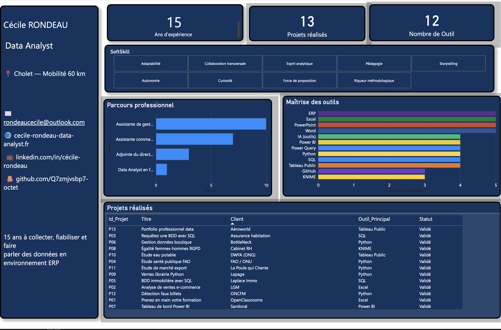
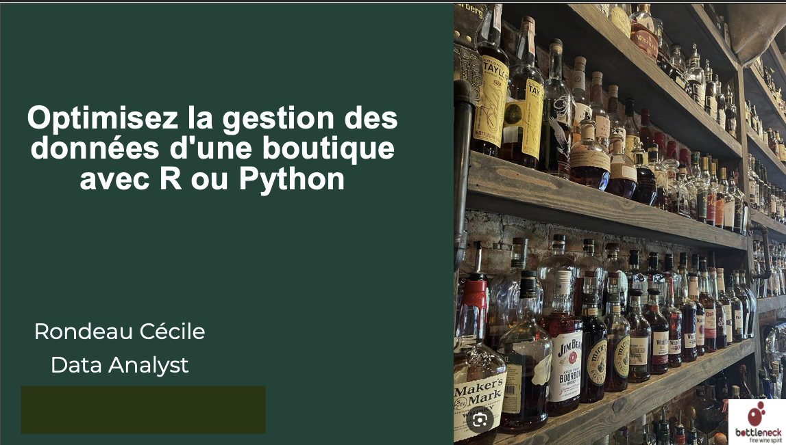
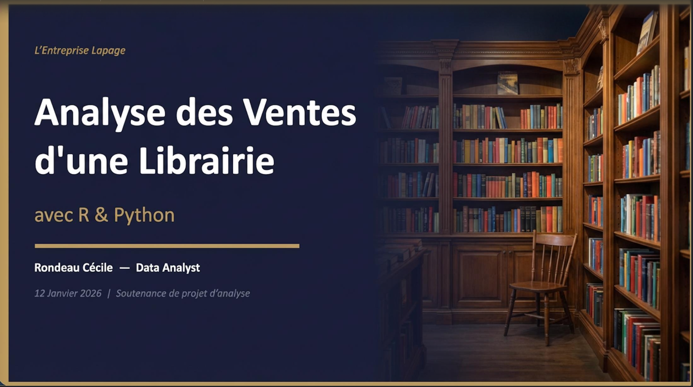
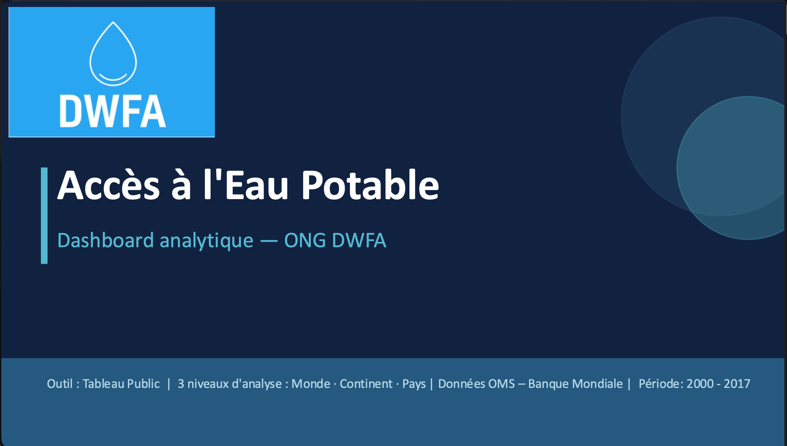
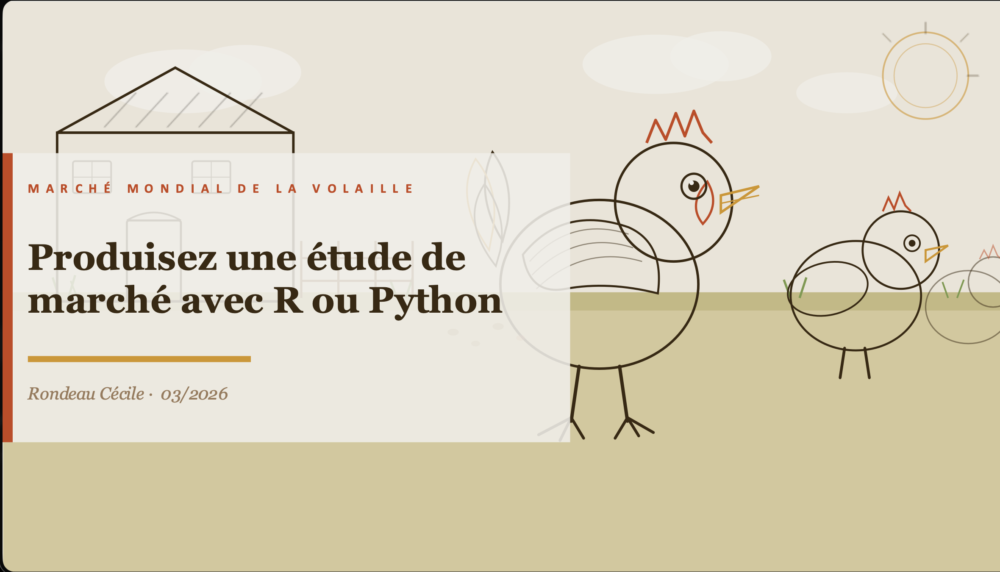
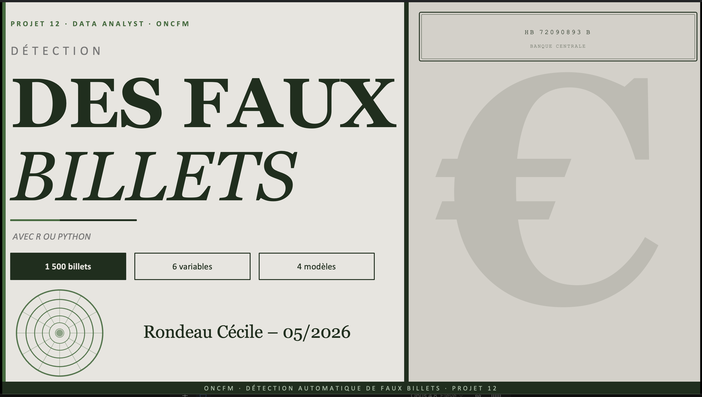
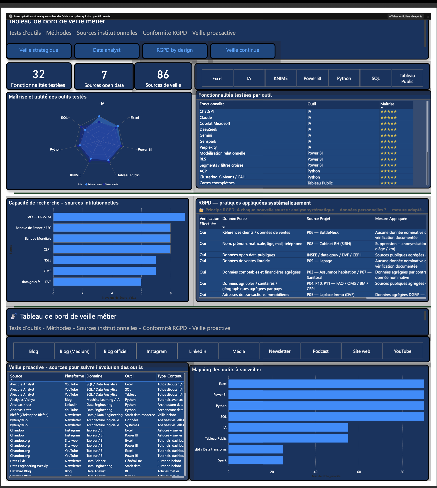

# Cécile RONDEAU — Data Analyst

> Les données ont toujours été mon terrain de jeu. 15 ans à les collecter, les fiabiliser et les faire parler en environnement ERP — et aujourd'hui un titre Data Analyst (RNCP niveau 6) pour aller encore plus loin.
> Analytique, curieuse et opérationnelle, je transforme des données complexes en décisions simples et actionnables.

📍 Cholet — Mobilité 60 km | Disponible en présentiel et à distance

📞 0670 75 58 95 | ✉️ rondeaucecile@outlook.com

📄 [Télécharger mon CV (PDF)](livrables/CV_Cecile_Rondeau.pdf)

🌐 [cecile-rondeau-data-analyst.fr](https://cecile-rondeau-data-analyst.fr)

💼 [LinkedIn](https://www.linkedin.com/in/cécile-rondeau-b79258aa)

---

**Compétences démontrées :**

SQL • Python • Power BI • KNIME • Tableau Public • ACP • Clustering • Machine Learning • Data Storytelling • Business Intelligence

---

## Table des matières

- [Projet 1 — Prenez en main votre formation de Data Analyst](projet1/)
- [Projet 2 — Faites une analyse de ventes pour un e-commerce](projet2/)
- [Projet 3 — Requêtez une base de données avec SQL](projet3/)
- [Projet 4 — Réalisez une étude de santé publique avec R ou Python](projet4/)
- [Projet 5 — Créez et utilisez une base de données immobilière avec SQL](projet5/)
- [Projet 6 — Optimisez la gestion des données d'une boutique](#projet-6)
- [Projet 7 — Créez un tableau de bord dynamique avec Power BI](projet7/)
- [Projet 8 — Analysez des indicateurs de l'égalité femmes/hommes dans le respect du RGPD](projet8/)
- [Projet 9 — Analysez les ventes d'une librairie](#projet-9)
- [Projet 10 — Faites une étude sur l'eau potable](#projet-10)
- [Projet 11 — Produisez une étude de marché](#projet-11)
- [Projet 12 — Détectez des faux billets](#projet-12)
- [Projet 13 — Créez votre portfolio professionnel de la data](projet13/)

---

## Qui je suis ? 

Passée des fonctions d'assistante de gestion, commerciale et adjointe de direction à la data analytique, je combine une connaissance concrète des environnements ERP et des enjeux métier avec des compétences techniques acquises en formation (RNCP niveau 6, Bac+3/4 — OpenClassrooms). Ce qui me distingue : je sais ce que les données représentent côté terrain avant même de les analyser.

---

📄 [Consulter le tableau de bord Profil (PDF)](livrables/Dashboard_Profil.pdf)
🔧 [Télécharger le fichier Power BI (.pbix)](livrables/Dashboard_Profil.pbix)

---

## Fiches projets 

---

## Projet 6

### Optimisez la gestion des données d'une boutique avec R ou Python

> **Client :** BottleNeck (boutique de vins en ligne)
> **Rôle :** Data Analyst | **Durée :** Octobre–Novembre 2025 | **Statut :** ✅ Validé

**Question métier :** Comment fiabiliser des données provenant de sources hétérogènes (ERP + Web) pour produire des analyses fiables ?

**Compétences :** Data Cleaning · Data Wrangling · EDA · RGPD · Business Intelligence

**Outils :** `Python` · `pandas` · `numpy` · `matplotlib` · `seaborn`

📁 [Voir le dossier complet](./projet6/)

---

## Projet 9

### Analysez les ventes d'une librairie avec R ou Python

> **Client :** Lapage (librairie physique + site en ligne) **Rôle :** Data Analyst | **Durée :** Janvier–Février 2026 | **Statut :** ✅ Validé

**Question métier :** Comment analyser les ventes et le comportement clients d'une librairie en ligne pour identifier les leviers de croissance ?

**Compétences :** Analyse temporelle · Segmentation clients · Concentration (Gini/Lorenz) · Tests statistiques · Business Intelligence

**Outils :** `Python` · `pandas` · `numpy` · `matplotlib` · `seaborn` · `scipy`

📁 [Voir le dossier complet](./projet9/)

---

## Projet 10

### Faites une étude sur l'eau potable

> **Client :** DWFA — Drinking Water For All (ONG) **Rôle :** Data Analyst | **Durée :** Mars–Avril 2026 |**Statut :** ✅ Validé

**Question métier :** Comment exploiter des données internationales sur l'accès à l'eau potable pour identifier des disparités territoriales et prioriser les zones d'intervention ?

**Compétences :** Data Storytelling · Business Intelligence · Data Viz · Data Prep & Blending · Accessibilité

**Outils :** `Tableau Public` · `Python` · `pandas`

📁 [Voir le dossier complet](./projet10/)

---

## Projet 11

### Produisez une étude de marché avec R ou Python

> **Client :** La Poule qui Chante (export de volailles)
> **Rôle :** Data Analyst | **Durée :** Avril–Mai 2026 | **Statut :** ✅ Validé

**Question métier :** Comment identifier les marchés internationaux les plus attractifs pour exporter du poulet français ?

**Compétences :** ACP · Clustering · Segmentation de marchés · Data Storytelling · Aide à la décision

**Outils :** `Python` · `pandas` · `numpy` · `matplotlib` · `seaborn` · `scikit-learn`

📂 [Voir le dossier complet](projet11)

---

## Projet 12

### Détectez des faux billets avec R ou Python

> **Client :** ONCFM — Organisation nationale de lutte contre le faux-monnayage
> **Rôle :** Data Analyst | **Durée :** Mai–Juin 2026 | **Statut :** ✅ Validé

**Question métier :** Comment différencier automatiquement un vrai billet d'un faux à partir de ses seules dimensions géométriques ?

**Compétences :** Apprentissage supervisé · Apprentissage non supervisé · Prédiction d'un phénomène statistique · Évaluation de modèles (matrice de confusion) · Aide à la décision

**Outils :** `Python` · `pandas` · `numpy` · `matplotlib` · `seaborn` · `scikit-learn` · `statsmodels`

📁 [Voir le dossier du projet](./projet12/)

---

## Ma veille métier

📄 [Consulter le tableau de bord Veille métier (PDF)](livrables/Dashboard_Veille_metier.pdf)
🔧 [Télécharger le fichier Power BI (.pbix)](livrables/Dashboard_Veille_metier.pbix)

---

### En complément : 

une [vidéo de formation Tableau Public (24 min)](https://youtu.be/tgopvckZXng) et une [documentation de procédure Power BI](livrables/Documentation_procedure_graphique.pdf), réalisées pour accompagner la prise en main des outils.

---

## Contact & CV

📄 [Télécharger mon CV (PDF)](livrables/CV_Cecile_Rondeau.pdf)

✉️ rondeaucecile@outlook.com

🌐 [cecile-rondeau-data-analyst.fr](https://cecile-rondeau-data-analyst.fr)

💼 [LinkedIn](https://www.linkedin.com/in/cécile-rondeau-b79258aa)

