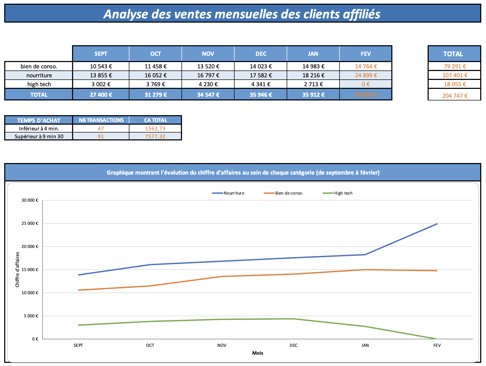

# 📊 Projet 2 — Faites une analyse de ventes pour un e-commerce

[← Retour au portfolio principal](../README.md)

---

## 📌 Résumé

Mission réalisée pour une entreprise e-commerce souhaitant mieux comprendre les performances de ses actions marketing et le comportement de ses visiteurs.

L'objectif était de construire un rapport mensuel à destination de la direction marketing afin de suivre les indicateurs clés et proposer des pistes d'amélioration.

> **Problématique :** Quels indicateurs suivre pour évaluer l'efficacité des actions marketing et améliorer la conversion des visiteurs en clients ?

---

## 🎯 Objectifs du projet

- Construire un tableau de bord synthétique
- Sélectionner des indicateurs pertinents
- Présenter les résultats de manière accessible
- Identifier les tendances marketing
- Formuler une recommandation stratégique

---

## 🔍 Données

Les données proviennent de l'activité d'un site e-commerce :

| Indicateur |
|------------|
| Chiffre d'affaires |
| Nombre de ventes |
| Nombre de visites |
| Taux de conversion |
| Temps passé sur le site |
| Montant moyen du panier |

---

## 📊 Analyses réalisées

### Évolution du chiffre d'affaires par catégorie

Analyse des performances commerciales des différentes catégories de produits.

### Nombre de ventes vs nombre de visites

Mesure de la capacité du site à transformer les visiteurs en acheteurs.

### Ratio achats / visites

Suivi de l'efficacité globale du tunnel de conversion.

### Temps passé sur le site avant achat

Analyse du comportement des visiteurs ayant réalisé un achat.

### Montant moyen du panier

Étude de l'évolution de la valeur moyenne des commandes.

---

## ✅ Compétences développées

| Compétence | Détail |
|---|---|
| Data Visualisation | Sélection et création de graphiques pertinents |
| Analyse Marketing | Interprétation des performances commerciales |
| Storytelling | Construction d'un rapport décisionnel |
| Communication | Présentation synthétique des résultats |
| Accessibilité | Choix de visualisations compréhensibles |

---

## 📈 Principaux enseignements

- La catégorie High-Tech reste le principal moteur du chiffre d'affaires.
- Le trafic progresse plus rapidement que les ventes.
- Le taux de conversion montre un potentiel d'amélioration.
- Les visiteurs passent davantage de temps sur le site avant achat.
- Le panier moyen augmente avec l'engagement des utilisateurs.

---

## 📊 Illustration

---

## 🗂 Structure du dossier

| Fichier / Dossier | Description |
|---|---|
| `enonce/` | Consignes OpenClassrooms |
| `donnees/` | Données sources |
| `livrables/` | Rapport PDF et tableau de bord Excel |
| `apercu.png` | Aperçu du projet |
| `README.md` | Présentation du projet |

---

## 🛠 Outils utilisés

- Excel
- Google Sheets
- Data Visualisation
- Storytelling
- Reporting Marketing

---

## 📋 Recommandation stratégique

L'analyse suggère de poursuivre les actions d'acquisition de trafic tout en optimisant le parcours utilisateur afin d'améliorer le taux de conversion et d'exploiter pleinement l'augmentation du nombre de visiteurs.

---

*Projet réalisé dans le cadre de la formation Data Analyst — OpenClassrooms (RNCP niveau 6)*
