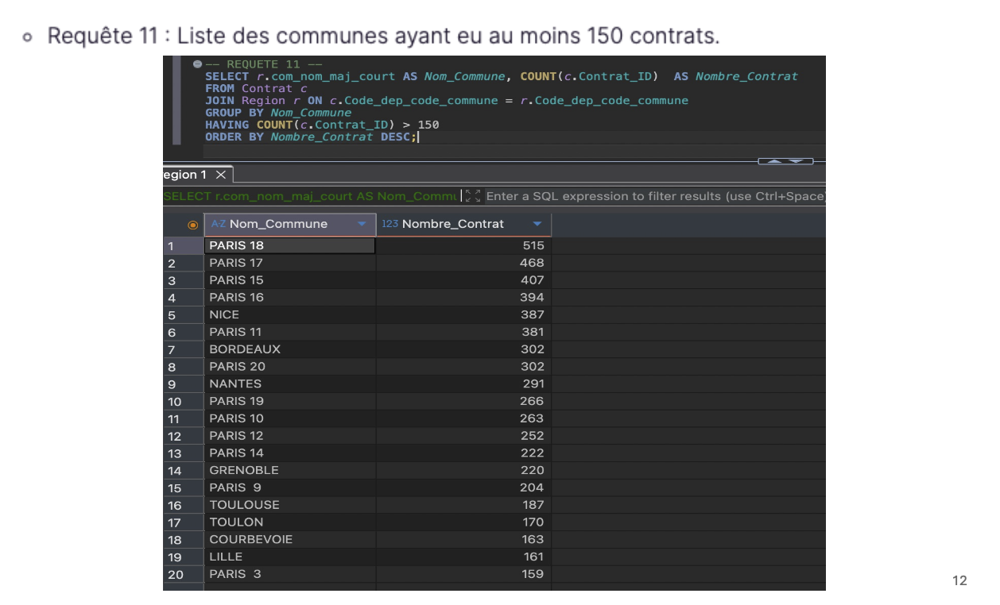

# 🗄️ Projet 3 — Requêtez une base de données avec SQL

[← Retour au portfolio principal](../README.md)

---

## 📌 Résumé

Mission réalisée pour une entreprise d'assurance habitation souhaitant mieux analyser son portefeuille de contrats clients.

L'objectif était de construire une base de données relationnelle à partir de deux fichiers CSV bruts, puis de rédiger des requêtes SQL pour extraire des informations décisionnelles.

> **Problématique :** Comment structurer, charger et interroger une base de données relationnelle pour répondre à des questions métier concrètes ?

---

## 🎯 Objectifs du projet

- Analyser et documenter les données sources (dictionnaire des données)
- Concevoir un schéma relationnel normalisé (2 tables reliées par clé étrangère)
- Créer et charger la base de données dans MySQL
- Rédiger 12 requêtes SQL pour répondre à des questions métier
- Présenter la méthodologie de manière structurée

---

## 🔍 Données

Deux fichiers CSV issus d'un système d'assurance habitation :

| Table | Contenu | Volume |
|---|---|---|
| `Contrat` | Contrats clients (type de local, surface, formule, cotisation…) | 30 335 lignes |
| `Region` | Référentiel géographique des communes et régions françaises | 38 916 lignes |

---

## 🔗 Modélisation

- Schéma relationnel conçu avec **Draw.io**
- Relation entre les deux tables via la clé `Code_dep_code_commune`
- Clé primaire `Contrat_ID` (table Contrat) et `Code_dep_code_commune` (table Region)
- Clé étrangère `Contrat_Region_FK`
- Base de données créée et chargée dans **MySQL**

---

## 📊 Requêtes réalisées

| N° | Question métier | Mots-clés SQL |
|---|---|---|
| 1 | Contrats et surface pour la commune de Caen | SELECT, FROM, JOIN, WHERE |
| 2 | Contrats de maisons dans le département 71 | SELECT, JOIN, WHERE, AND |
| 3 | Liste des régions de France | SELECT DISTINCT, ORDER BY |
| 4 | Les 5 contrats avec les plus grandes surfaces | ORDER BY DESC, LIMIT |
| 5 | Prix moyen de la cotisation mensuelle | AVG, AS |
| 6 | Nombre de contrats par valeur déclarée des biens | COUNT, GROUP BY, ORDER BY |
| 7 | Formules "Intégral" en Pays de la Loire | JOIN, WHERE, COUNT |
| 8 | Contrats de maisons dans le département 71 avec formule | SELECT, JOIN, WHERE |
| 9 | Surface moyenne des contrats à Paris | AVG, JOIN, WHERE |
| 10 | Top 10 départements par cotisation moyenne | AVG, GROUP BY, ORDER BY DESC, LIMIT |
| 11 | Communes avec plus de 150 contrats | COUNT, GROUP BY, HAVING, ORDER BY |
| 12 | Nombre de contrats par région | COUNT, GROUP BY, ORDER BY |

---

## ✅ Compétences développées

| Compétence | Détail |
|---|---|
| Modélisation BDD | Dictionnaire des données, schéma relationnel normalisé |
| SQL — Requêtes simples | SELECT, FROM, WHERE, ORDER BY |
| SQL — Requêtes complexes | JOIN, GROUP BY, HAVING, AVG, COUNT, LIMIT, DISTINCT |
| Gestion de BDD | Création et chargement de tables dans MySQL |
| Documentation | Présentation structurée de la méthodologie |

---

## 🛠 Outils utilisés

---

## 📈 Principaux résultats

- Base de données opérationnelle : 30 335 contrats et 38 916 communes chargés
- Paris (75) est le département avec la cotisation moyenne la plus élevée (36,40 €)
- L'Île-de-France concentre 14 177 contrats sur 30 335 au total
- 589 contrats "Intégral" recensés en Pays de la Loire
- 20 communes ont plus de 150 contrats, dominées par les arrondissements parisiens

---

## 📊 Illustration

---

## 🗂 Structure du dossier

| Fichier / Dossier | Description |
|---|---|
| `enonce/` | Consignes OpenClassrooms |
| `donnees/` | Fichiers CSV sources (Contrat, Region) |
| `livrables/` | Document technique, liste des requêtes, méthodologie, grille d'évaluation, requêtes individuelles (PDF) |
| `apercu.png` | Aperçu du projet |
| `README.md` | Présentation du projet |

---

*Projet réalisé dans le cadre de la formation Data Analyst — OpenClassrooms (RNCP niveau 6)*
