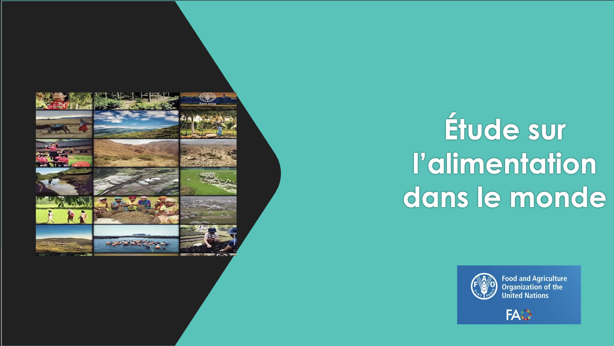

# Projet 4 — Étude de santé publique : la sous-nutrition dans le monde

[← Retour au portfolio principal](../README.md)

---

## Contexte

Dans le cadre d'une mission pour la FAO (Food and Agriculture Organization — ONU),
j'intègre une équipe de chercheurs chargée d'une étude mondiale sur la sous-nutrition.
Mon périmètre couvre la partie historique de l'étude : **2013 à 2017**,
en continuité du travail de Julien, l'ancien Data Analyst de l'équipe.

**Question centrale :** La faim dans le monde est-elle un problème de production
alimentaire ou de répartition des ressources ?

---

## Données

4 fichiers source issus de FAOSTAT :

| Fichier | Contenu |
|---|---|
| `dispo_alimentaire.csv` | Disponibilité alimentaire 2017 — pays, produits, type (animal/végétal), métriques nutritionnelles |
| `sous_nutrition.csv` | Pays, intervalles d'années, nombre de personnes sous-alimentées (millions) |
| `population.csv` | Pays, année, population (millions) |
| `aide_alimentaire.csv` | Pays bénéficiaire, année, produit, quantités (tonnes) |

---

## Méthodologie

Les données sont publiques, agrégées et anonymisées par construction —
leur utilisation ne constitue pas un traitement de données personnelles
et respecte les principes du RGPD.

**Prétraitement appliqué :**
- Homogénéisation des unités : données en milliers de tonnes converties en kilogrammes ;
  population en milliers de personnes convertie en millions
- Valeurs manquantes sur quantités physiques (productions, importations)
  et indicateurs nutritionnels remplacées par 0 — l'absence de valeur
  traduit l'absence de flux
- Données de population et d'aide alimentaire non imputées
  pour éviter toute interprétation erronée
- Uniformisation de l'ensemble des champs pour obtenir une base nationale cohérente

---

## Résultats clés

### Sous-nutrition mondiale en 2017
- **535 millions** de personnes sous-alimentées, soit **7,1 %** de la population mondiale
- La faim touche une personne sur 14

### Évolution 2013–2017
- La population mondiale augmente (7,207 Md → 7,544 Md)
- Le taux de sous-nutrition ne recule pas : 7,33 % en 2013, 7,10 % en 2017

### La faim n'est pas un problème de production
- Disponibilité alimentaire mondiale totale 2017 : **20 918 984 627 331 kcal/jour**
- Population réelle : 7,291 milliards — Population théoriquement nourrie : **10,459 milliards**
- La production mondiale pourrait nourrir **3 milliards de personnes supplémentaires**

### Répartition des calories : végétal vs animal
- 82,5 % des calories mondiales proviennent du végétal — 17,5 % de l'animal
- Les végétaux seuls pourraient nourrir 8,6 milliards de personnes

### Bilan mondial de la disponibilité alimentaire

| Catégorie | Part (%) |
|---|---|
| Alimentation humaine | 49,51 % |
| Alimentation animale | 13,24 % |
| Autres usages | 32,64 % |
| Pertes | 4,61 % |

### Utilisation des céréales
- 42,58 % alimentation humaine · 36,22 % alimentation animale · 21,19 % autres usages
- Réduire de 5 % l'usage des céréales pour l'alimentation animale libérerait
  l'équivalent de l'alimentation de **154 millions de personnes**

### Pays les plus touchés par la sous-nutrition en 2017
Haïti 48,26 % · Corée du Nord 47,19 % · Madagascar 41,06 % · Libéria 38,28 % · Lesotho 38,25 %

### Disponibilité alimentaire par habitant
- **La plus faible :** République centrafricaine 1 879 kcal/pers/jour · Zambie 1 924
- **La plus haute :** Autriche 3 770 · Belgique 3 737 · Turquie 3 708

### Aide alimentaire mondiale 2013–2016
- 3 pays absorbent plus de 40 % des volumes totaux
- Top 3 : République arabe syrienne 16,84 % · Éthiopie 12,52 % · Yémen 10,93 %
- Le Yémen enregistre une explosion en 2016 : 62,61 % du total mondial cette année-là

### Analyse complémentaire — Thaïlande
- Taux de sous-nutrition non linéaire : 9,1 % (2013) → 8,6 % (2015) → 9,0 % (2017)
- Disponibilité alimentaire stable à 2 785 kcal/pers/jour malgré la hausse de population
- Flux du manioc 2017 : production 30,23 Md kg —
  exportations 25,21 Md kg (83,4 %) — seulement 13,9 % destiné à l'alimentation humaine

---

## Conclusion

Le monde ne manque pas de nourriture : il manque d'équité.
La sécurité alimentaire ne dépend pas de produire davantage,
mais de mieux répartir les ressources et d'agir là où les vulnérabilités se concentrent.
Le levier est structurel, stratégique et politique.

---

## Outils utilisés

| Outil | Usage |
|---|---|
| Python 3 | Langage principal |
| pandas | Chargement, nettoyage, jointures, calculs |
| matplotlib / plotly | Visualisations |
| Jupyter Notebook | Environnement d'analyse |

---

## Compétences démontrées

- Chargement et jointure de plusieurs DataFrames hétérogènes
- Nettoyage et homogénéisation d'unités de mesure
- Création de variables calculées (taux, ratios, capacités théoriques)
- Analyse temporelle 2013–2017 et analyse par pays
- Visualisations : camembert, barres horizontales, double axe, carte choroplèthe
- Analyse complémentaire approfondie (Thaïlande, flux manioc)
- Présentation des résultats à un public non technique

---

## Livrables

## 📋 Livrables

- 📓 [Notebook Python — analyse complète](./livrables/Rondeau_Cecile_1_notebook_112025.ipynb)
- 📄 [Export PDF du notebook](./livrables/Rondeau_Cecile_2_notebook_112025.pdf)
- 📊 [Présentation des résultats](./livrables/Rondeau_Cécile_3_presentation_112025pdf.pdf)

---

## 🗂 Structure du dossier

| Fichier / Dossier | Description |
|-------------------|-------------|
| `enonce/` | PDFs OpenClassrooms (scénario, mission, livrables) |
| `donnees/` | Fichiers sources : dispo_alimentaire · sous_nutrition · population · aide_alimentaire |
| `livrables/` | Notebook Python · Export PDF · Présentation des résultats |
| `apercu.png` | Capture d'écran de la visualisation principale |
