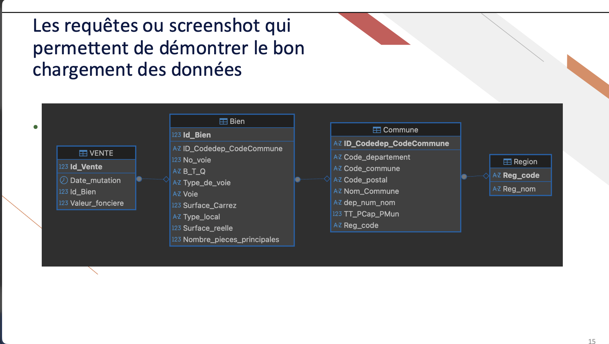

# 🗄️ Projet 5 — Création et utilisation d'une base de données immobilière avec SQL

[⬅ Retour au portfolio principal](../README.md)

---

## 📌 Résumé

Mission de Data Analyst pour **Laplace Immo**, réseau national d'agences immobilières.
La CTO Clara Daucourt a confié la conception et l'exploitation d'une base de données
immobilière dans le cadre du projet stratégique interne **DATAImmo**.

---

**Problématique :** Comment concevoir une base de données relationnelle normalisée à
partir de sources hétérogènes, la peupler et l'exploiter via des requêtes SQL pour
répondre aux besoins d'analyse du marché immobilier français ?

---

## 🎯 Objectifs du projet

- Analyser et nettoyer trois sources de données open data
- Concevoir un schéma relationnel normalisé (3NF) conforme RGPD
- Créer et peupler une base de données MySQL opérationnelle
- Répondre à 12 questions d'analyse via des requêtes SQL

---

## 🔍 Données sources

| Source | Contenu |
|--------|---------|
| DVF — open data DGFiP | Transactions immobilières 1er semestre 2020 |
| INSEE | Recensement de la population par commune |
| data.gouv — référentiel géographique | Communes, départements, régions |

---

## 🛠 Méthodologie

**Phase 1 — Conception**
- Analyse des trois fichiers sources et identification des variables utiles
- Rédaction du dictionnaire des données (conformité RGPD : suppression des données personnelles)
- Modification du schéma relationnel existant pour intégrer les données de population et de région
- Normalisation en 3NF : 4 tables (Bien, Vente, Commune, Region) avec clés primaires et étrangères

**Phase 2 — Implémentation**
- Création de la base de données sous MySQL
- Préparation des données sources et import dans les 4 tables
- Contrôle d'intégrité : 34 169 lignes dans Bien et Vente · 3 125 communes · 19 régions

**Phase 3 — Exploitation**
- Rédaction et exécution de 12 requêtes SQL à la demande du directeur général
- Utilisation de JOIN, GROUP BY, sous-requêtes, fonctions fenêtrées (RANK, OVER)
- Aliasage systématique pour lisibilité

---

## ✅ Compétences développées

| Compétence | Détail |
|-----------|--------|
| Modélisation relationnelle | Schéma 3NF · clés primaires/étrangères · cardinalités |
| Conformité RGPD | Dictionnaire des données · suppression données personnelles |
| Administration BDD | Création et peuplement MySQL · contrôle d'intégrité |
| Requêtes SQL avancées | JOIN · GROUP BY · HAVING · sous-requêtes · fonctions fenêtrées |

---

## 📊 Résultats — 12 requêtes SQL

| # | Question | Résultat |
|---|----------|---------|
| 1 | Appartements vendus au 1er semestre 2020 | 31 378 |
| 2 | Ventes par région (1er semestre 2020) | Île-de-France : 13 995 |
| 3 | Proportion des ventes par nombre de pièces | 2 pièces : 31,18 % |
| 4 | Top 10 départements par prix/m² | Paris (75) : 12 052 €/m² |
| 5 | Prix moyen m² maison en Île-de-France | 3 745 €/m² |
| 6 | Top 10 appartements les plus chers | Île-de-France · jusqu'à 9 000 000 € |
| 7 | Taux d'évolution T1 → T2 2020 | +3,68 % |
| 8 | Classement régions — appart. > 4 pièces | Île-de-France : 8 770 €/m² |
| 9 | Communes ≥ 50 ventes au T1 2020 | 48 communes |
| 10 | Différence prix/m² — 2 pièces vs 3 pièces | −12,4 % |
| 11 | Top 3 communes — dép. 6, 13, 33, 59, 69 | Saint-Jean-Cap-Ferrat : 968 750 € |
| 12 | Top 20 communes — transactions/1000 hab. | Paris 02 : 5,84 |

---

## 📊 Illustration

---

## 🗂 Structure du dossier

| Fichier / Dossier | Description |
|-------------------|-------------|
| `enonce/` | PDFs OpenClassrooms (scénario, mission, livrables) |
| `donnees/` | Fichiers sources : DVF · INSEE · data.gouv |
| `livrables/` | Dictionnaire des données · Support de présentation |
| `apercu.png` | Capture d'écran du schéma relationnel |

---

## 📋 Livrables

- 📄 [Dictionnaire des données](./livrables/Rondeau_Cecile_1_dictionnaire_de_données_092025.pdf)
- 📊 [Support de présentation — schéma, tables et requêtes SQL](./livrables/Rondeau_Cécile_2_support_présentation_092025.pdf)

---

*Projet réalisé dans le cadre de la formation Data Analyst — OpenClassrooms (RNCP niveau 6)*
