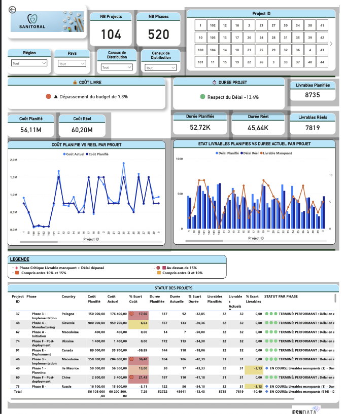

# 📊 Projet 7 — Tableau de bord dynamique Power BI · Suivi de projets internationaux

[⬅ Retour au portfolio principal](../README.md)

---

## 📌 Résumé

Mission de consultant Data Analyst chez **ESN Data**, déployé chez le client **Sanitoral** — société internationale de soins bucco-dentaires présente dans 4 régions mondiales.

**Problématique :** Comment concevoir un tableau de bord interactif permettant à trois niveaux de direction de piloter en temps réel l'avancement, les coûts et les livrables de 104 projets IT et Marketing répartis dans le monde ?

---

## 🎯 Objectifs du projet

- Analyser et préparer les données projet via Power Query Editor
- Construire un modèle de données relationnel à 7 tables
- Créer un tableau de bord interactif multi-rôles sous Power BI
- Mettre en place des alertes automatiques sur les écarts de performance
- Documenter la procédure de mise à jour pour autonomie complète du client

---

## 🔍 Données

| Source | Contenu |
|--------|---------|
| `Donnees_Sanitoral.xlsx` | 7 tables : Projects_Plans · Actual_Costs · Actual_Duration · Actual_Delivrable · Project_Type · Projects_Locations · Country_Profiles |
| Périmètre temporel | Projets 2018 — début 2022 |
| Volume | 104 projets · 520 phases · 4 régions · 35+ pays |

---

## 🛠 Méthodologie

**Phase 1 — Cadrage**
- Rédaction de la note de cadrage (besoins, contraintes, indicateurs)
- Formalisation des user stories dans un Product Strategy Canvas (3 profils utilisateurs · 3 stories chacun)

**Phase 2 — Préparation des données**
- Nettoyage et transformation via Power Query Editor (étapes appliquées automatisées)
- Création d'une clé unique `ProjectPhaseKey` par concaténation de `Project ID` et `Phase`
- Fusion des tables Actual_Costs · Actual_Duration · Actual_Delivrable dans Projects_Plans
- Modèle de données : 7 tables reliées par clés primaires/étrangères

**Phase 3 — Tableau de bord**
- 2 pages principales : Vue Globale (Performance & Suivi) · Vue Géographique (Répartition & Planification)
- 3 rôles distincts : Directeur Général · Directeurs Régionaux · Directeurs de Pays
- Alertes automatiques DAX : seuil de 15 % d'écart sur coûts, délais ou livrables
- Carte du monde interactive · Diagramme de Gantt · Info-bulles · Boîte Q&A

---

## ✅ Compétences développées

| Compétence | Détail |
|-----------|--------|
| Cadrage de projet | Note de cadrage · Product Strategy Canvas · user stories |
| Préparation des données | Power Query Editor · clés calculées · fusion de tables |
| Modélisation | Modèle relationnel 7 tables · cardinalités · directions de filtrage |
| Visualisation avancée | DAX · info-bulles · Gantt · carte choroplèthe · Q&A |
| Gestion multi-rôles | Sécurité au niveau des lignes (RLS) · 3 profils directeurs |
| Documentation | Procédure de mise à jour autonome pour le client |

---

## 📊 Résultats clés

| Indicateur | Planifié | Réel | Écart |
|-----------|---------|------|-------|
| Coût total | 56,11 M€ | 60,20 M€ | 🟠 +7,3 % |
| Durée totale | 52 722 j | 45 641 j | 🟢 −13,4 % |
| Livrables | 8 735 | 7 819 | 🔷 −10,5 % · 916 manquants |

- Seuil d'alerte : **15 %** d'écart sur l'un des 3 indicateurs
- Projets critiques identifiés : livrable manquant + délai dépassé

---

## 📊 Illustration

---

## 🗂 Structure du dossier

| Fichier / Dossier | Description |
|-------------------|-------------|
| `enonce/` | PDFs OpenClassrooms (mission, étapes, livrables) |
| `donnees/` | Fichier source : Donnees_Sanitoral.xlsx · Dictionnaire des données |
| `livrables/` | Tableau de bord Power BI (.pbix) · Export PDF |
| `apercu.png` | Capture de la vue globale du tableau de bord |

---

## 📋 Livrables

- 📊 [Tableau de bord Power BI](./livrables/Rondeau_Cecile_7_Tableau%20de%20bord_092025.pbix)
- 📄 [Export PDF du tableau de bord](./livrables/Rondeau_Cecile_Tableau_de_bord_092025.pdf)

---

*Projet réalisé dans le cadre de la formation Data Analyst — OpenClassrooms (RNCP niveau 6)*
